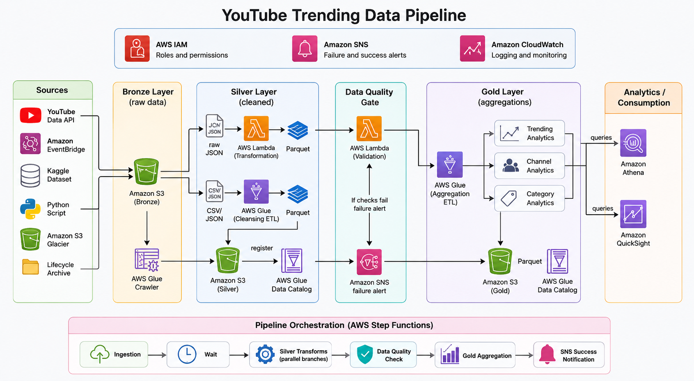
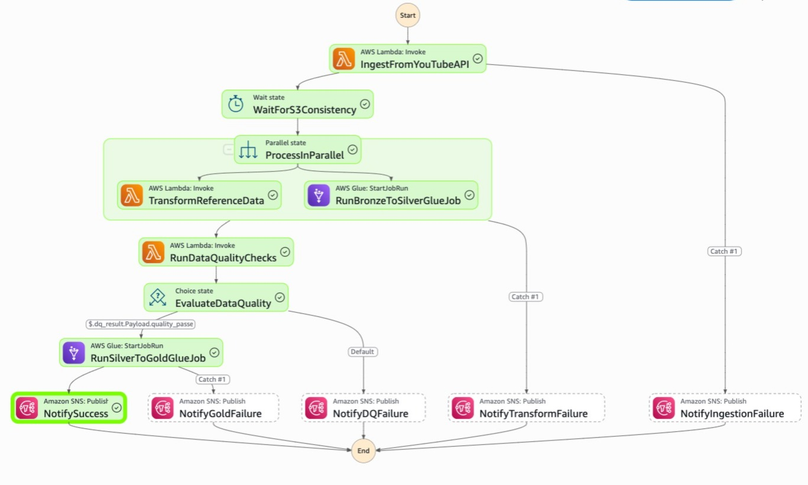
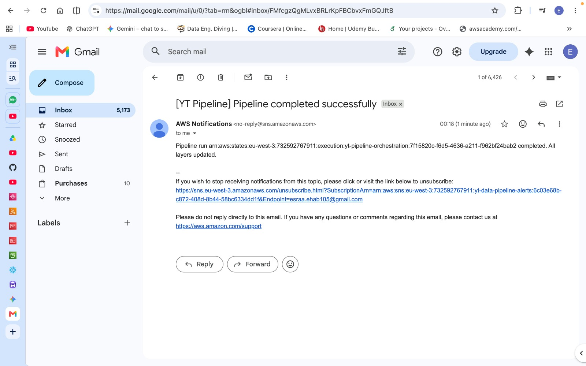

# AWS YouTube Data Pipeline

A serverless data pipeline that ingests YouTube trending data, converts it to Parquet, and prepares analytics-ready datasets using AWS Lambda and AWS Glue. This repository is a portfolio project demonstrating end-to-end data engineering on AWS with orchestration via Step Functions.



## Highlights

- Ingests YouTube trending CSVs for multiple countries.
- Uses AWS Lambda for ingestion and format conversion.
- Uses AWS Glue jobs to transform Bronze → Silver → Gold layers.
- Orchestrated with AWS Step Functions for resilient, auditable runs.
- Designed for analytics and data-quality checks.

## Demo Images

Step Function orchestration:



Success notification example:



## Repository Structure

- `assets/` — architecture and demo images.
- `data/` — example CSV inputs (country-specific trending videos).
- `lambda/` — AWS Lambda functions:
	- `json_to_parquet/lambda_function.py` — convert JSON to Parquet for downstream processing.
	- `youtube_api_ingestion/lambda_function.py` — ingestion function that fetches and writes raw data.
- `glue_jobs/` — AWS Glue job scripts:
	- `bronze_to_silver_statistics.py`
	- `silver_to_gold_analytics.py`
- `step_functions/` — Step Functions state machine definition: `pipeline_orchestration.json`.
- `data_quality/` — lightweight data-quality checks (`dq_lambda.py`).
- `Scripts/` — helpful scripts (e.g., `aws_copy.sh`) and notes.

## Data files

Static data can be viewed [here](https://www.kaggle.com/datasets/datasnaek/youtube-new)

Country CSVs (examples):

- [data/USvideos.csv](data/USvideos.csv)
- [data/GBvideos.csv](data/GBvideos.csv)
- [data/INvideos.csv](data/INvideos.csv)

## How it works (summary)

1. The ingestion Lambda polls the YouTube API (or consumes uploaded CSVs) and stores raw JSON/CSV in S3 (Bronze).
2. A `json_to_parquet` Lambda converts raw JSON to Parquet and stores it for Glue to consume.
3. Glue jobs run transforms to create Silver (cleaned, partitioned Parquet) and Gold (analytical aggregates).
4. Step Functions orchestrate the flow, triggering Lambdas and Glue jobs, and recording success/failure.

## Run locally / Quick test

These components are simple Python scripts you can run locally for quick testing. They may require AWS credentials or local test data in `data/`.

To run a Lambda function locally (quick smoke test):

```bash
python lambda/youtube_api_ingestion/lambda_function.py
python lambda/json_to_parquet/lambda_function.py
```

Note: Full end-to-end execution requires deploying Lambdas, Glue jobs, and Step Functions to AWS.

## Deployment notes

- Infrastructure as Code is not included in this repo — deploy the Lambdas, Glue jobs, and Step Functions through your preferred IaC tool (CloudFormation, CDK, Terraform) or manually via the AWS Console.
- Ensure an S3 bucket exists for Bronze/Silver/Gold layers and update function Glue job parameters accordingly.

## For reviewers / Portfolio talking points

- Demonstrates serverless architecture, data partitioning, and parquet conversion.
- Shows practical use of AWS Glue for ETL and Step Functions for orchestration.
- Includes sample datasets to reproduce parts of the pipeline locally.

## Contact

If you'd like to run this end-to-end or convert it into a cloud-deployable demo, open an issue or contact the author.
